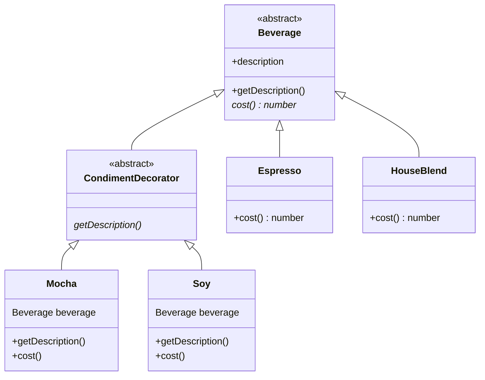

```mermaid
 classDiagram
  class Beverage{
    <<abstract>>
    +description
    +getDescription()
    cost()*  number
  }
  class CondimentDecorator{
    <<abstract>>
    getDescription()*
  }

  class Espresso{
    +cost() number
  }

  class HouseBlend{
    +cost() number
  }

  class Mocha{
    Beverage beverage
    +getDescription()
    +cost()
  }
    class Soy{
    Beverage beverage
    +getDescription()
    +cost()
  }

  Beverage <|-- Espresso
  Beverage <|-- HouseBlend
  Beverage <|-- CondimentDecorator
  CondimentDecorator <|-- Mocha
  CondimentDecorator <|-- Soy

```
