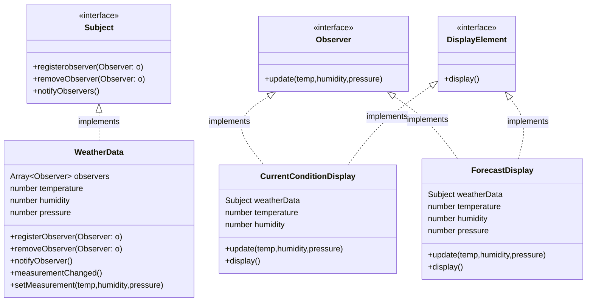

```mermaid
 classDiagram
    class Subject{
      <<interface>>
      +registerobserver(Observer: o)
      +removeObserver(Observer: o)
      +notifyObservers()
    }
    class WeatherData{
      Array~Observer~ observers
      number temperature
      number humidity
      number pressure

      +registerObserver(Observer: o)
      +removeObserver(Observer: o)
      +notifyObserver()
      +measurementChanged()
      +setMeasurement(temp,humidity,pressure)

    }

    class Observer{
      <<interface>>
      +update(temp,humidity,pressure)
    }
    class DisplayElement{
      <<interface>>
      +display()
    }

    class CurrentConditionDisplay{
      Subject weatherData
      number temperature
      number humidity
      +update(temp,humidity,pressure)
      +display()
    }
    class ForecastDisplay{
      Subject weatherData
      number temperature
      number humidity
      number pressure
      +update(temp,humidity,pressure)
      +display()
    }

    Observer <|.. CurrentConditionDisplay: implements
    DisplayElement <|.. CurrentConditionDisplay: implements

    Observer <|.. ForecastDisplay: implements
    DisplayElement <|.. ForecastDisplay: implements

    Subject <|.. WeatherData: implements


```
