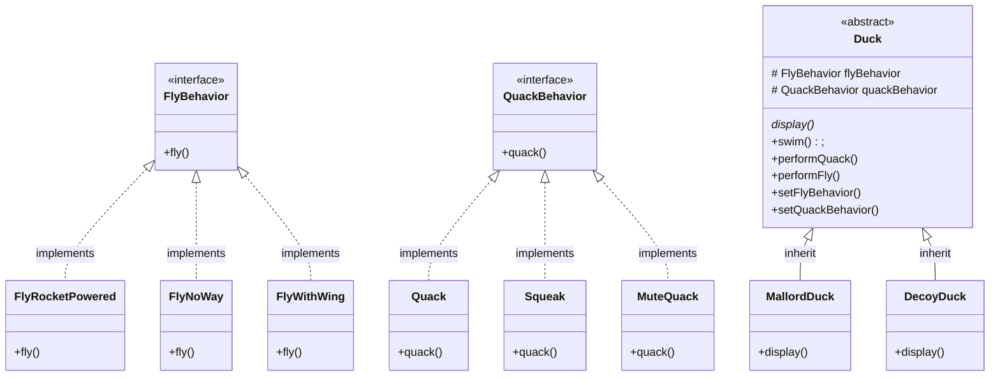

```mermaid
  classDiagram
    class FlyBehavior{
      +fly()
    }
    <<interface>>FlyBehavior
    class FlyWithWing{
      +fly()
    }
    class FlyNoWay{
      +fly()
    }
    class FlyRocketPowered{
      +fly()
    }
    FlyBehavior <|.. FlyRocketPowered:implements
    FlyBehavior <|.. FlyNoWay:implements
    FlyBehavior <|.. FlyWithWing:implements

    class QuackBehavior{
      +quack()
    }
    <<interface>>QuackBehavior
    class Quack{
      +quack()
    }
    class Squeak{
      +quack()
    }
    class MuteQuack{
      +quack()
    }
    QuackBehavior <|.. Quack:implements
    QuackBehavior <|.. Squeak:implements
    QuackBehavior <|.. MuteQuack:implements

  class Duck {
    <<abstract>>
    # FlyBehavior flyBehavior
    # QuackBehavior quackBehavior
    display()*
    +swim();
    +performQuack()
    +performFly()
    +setFlyBehavior()
    +setQuackBehavior()
  }

  class MallordDuck{
    +display()
  }
  class DecoyDuck{
    +display()
  }

  Duck <|-- MallordDuck:inherit
  Duck <|-- DecoyDuck:inherit

```
